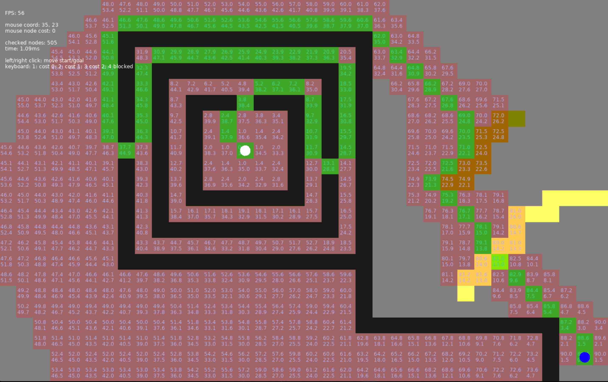

AStar
========

An other A* library. You can use the node or map mode you like(gird, point, mesh or infinite map).

The library don't need to init a map and don't care the size of your map.
We just tell the algo how to get node, neighbors and estimate cost.

Base algorithm logic referenced [a-star-lua](https://github.com/lattejed/a-star-lua)



## Use

A example for grid map

```lua
local AStar = require 'astar'

local map = {}
local cached_nodes = {}

-- Node must be able to check if they are the same
-- Cannot directly return different tables for the same coord
-- The library doesn't change nodes, so you able to reuse your node or create a C struct for faster
function map:get_node(x, y)
  local row = cached_nodes[y]
  if not row then row = {}; cached_nodes[y] = row end
  local node = row[x]
  if not node then node = { x = x, y = y }; row[x] = node end
  return node
end

local neighbors_offset = {
  { -1, -1 }, { 0, -1 }, { 1, -1 },
  { -1, 0 }, { 1, 0 },
  { -1, 1 }, { 0, 1 }, { 1, 1 },
}
-- Return all neighbor nodes. Means a target that can be moved from the current node
function map:get_neighbors(node, from_node, user_data)
  local nodes = {}
  for i, offset in ipairs(neighbors_offset) do
    nodes[i] = self:get_node(node.x + offset[1], node.y + offset[2])
  end
  return nodes
end

-- Cost of two adjacent nodes.
-- Distance, distance + cost or other comparison value you want
function map:get_cost(from_node, to_node)
  return math.sqrt(math.pow(from_node.x - to_node.x, 2) + math.pow(from_node.y - to_node.y, 2))
end

-- For heuristic. Estimate cost of current node to goal node
-- As close to the real cost as possible
function map:estimate_cost(node, goal_node)
  return self:get_cost(node, goal_node)
end

local finder = AStar.new(map)
local start_x, start_y = 1, 1
local goal_x, goal_y = 3, 4
local path = finder:find(start_x, start_y, goal_x, goal_y)

if path then
  for _, node in ipairs(path) do
    print(node.x, node.y)
  end
else
  print("Not found path")
end
```

And you can try to run the `main.lua` by Love2d

